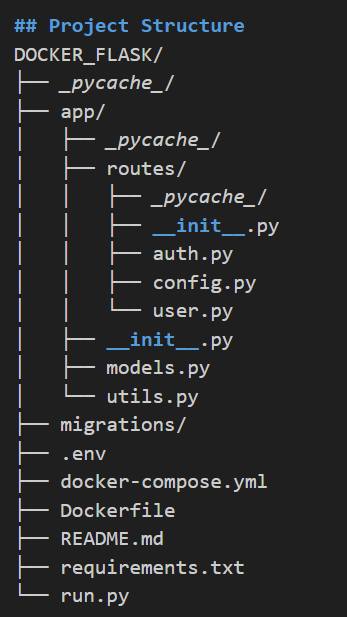
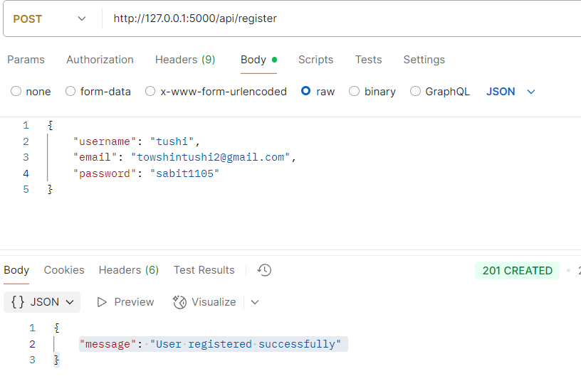
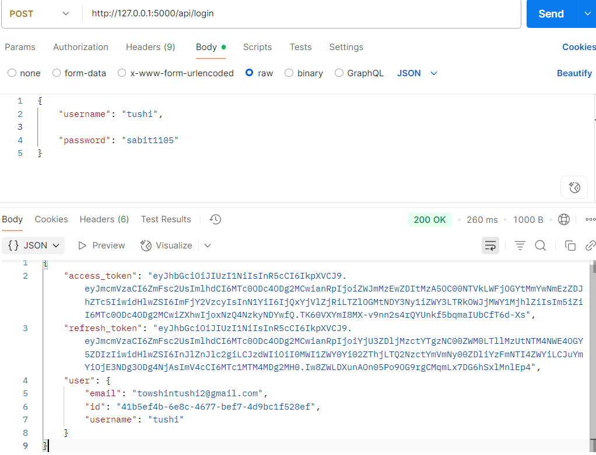
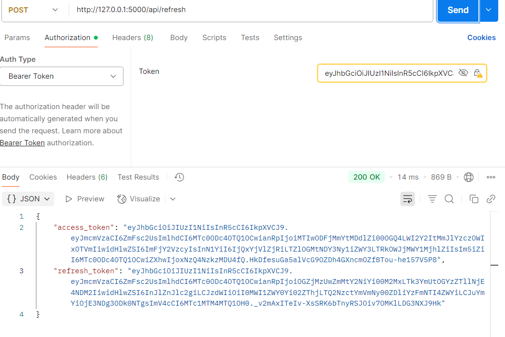
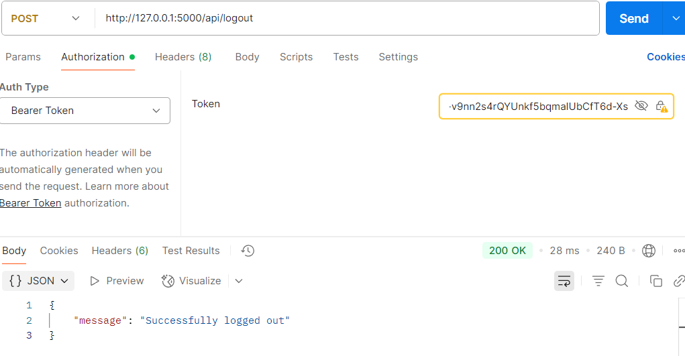
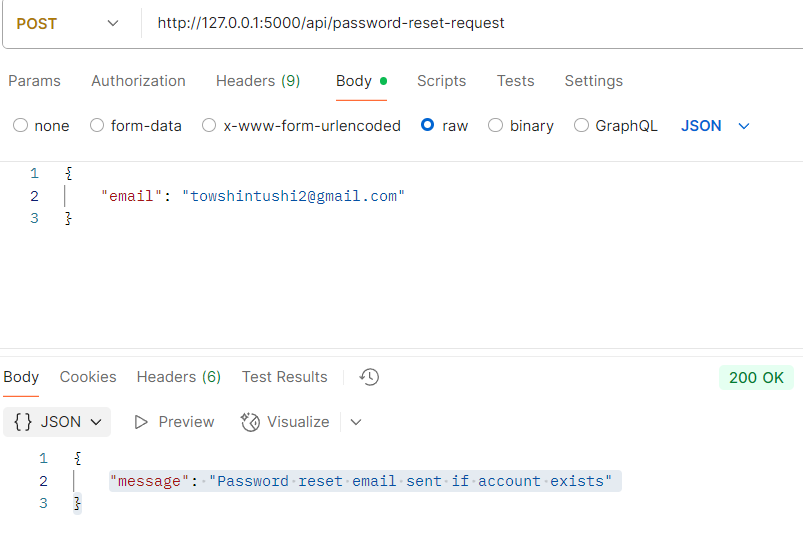
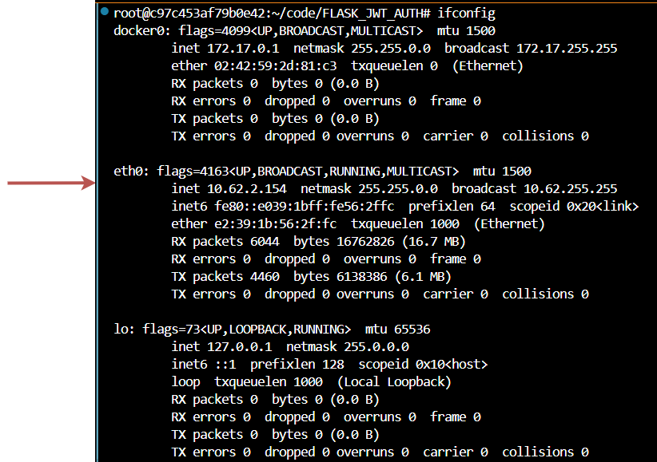
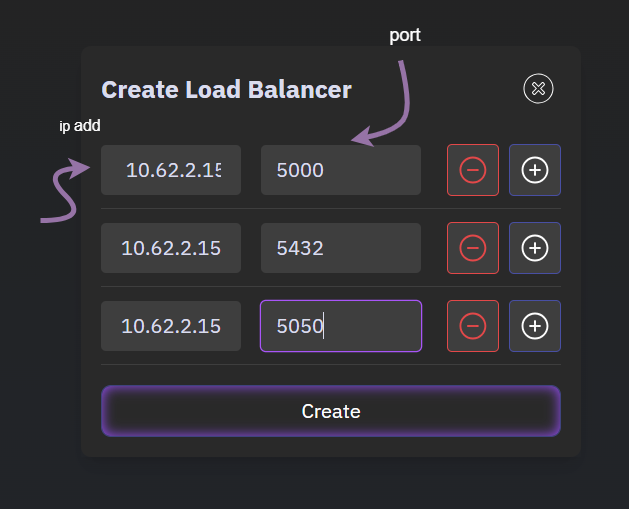
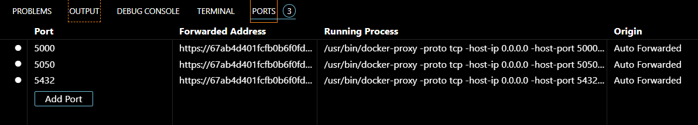

# 🔐 Flask JWT Authentication with Docker & PostgreSQL

A secure Flask application that implements JWT-based user authentication and authorization. Fully containerized using Docker, connected to a PostgreSQL database, and monitored through pgAdmin.

---

## 🗂️ Table of Contents

-  [📌 Overview](#-overview)
- [🧠 Project Architecture](#-project-architecture)
   - [Project structure](#-structure)
- [📦 Tech Stack](#-tech-stack)   
- [🚀 Getting Started](#-getting-started)
    - [Project set-up](#-setup)
- [⚙️ Services & Ports](#️-services--ports)
- [API Documentation](#api-documentation)
  - [APi Testing](#authentication-flow)
  - [API Tesing using Postman](#examples)
- [🔌 Port Mapping](#-port-mapping)
- [Troubleshooting](#troubleshooting)
- [📃 License](#-license) 

---

## 📌 Overview

This project demonstrates how to:

- Build a modular Flask app with JWT Auth (access + refresh tokens)
- Use PostgreSQL for user/token storage
- Monitor and manage the database via pgAdmin
- Containerize the entire stack using Docker Compose

---

## 🧠 Project Architecture

The architecture includes three main Docker containers:

- `Flask App`: Provides the RESTful authentication API.
- `PostgreSQL`: Stores users and JWT-related token data.
- `pgAdmin`: A web-based UI to manage PostgreSQL.

.svg)

---


## 📁 Project Structure



### Tech Stack
- Backend: Flask
- Database: PostgreSQL
- Authentication: JWT(Access & Refresh Token)
- Containerization: Docker , Docker compose
- DB Admin: pgAdmin 

### Getting Started
### Project Set Up

#### Prerequisites

- Docker 
- Docker Compose

1. **Clone Repository**:

   ```bash
   git clone https://github.com/Towshin05/FLASK_JWT_AUTH.git
   cd FLASK_JWT_AUTH
   ```

2. **Configure Environment Variables**:

   Create a `.env` file with the following variables:

   ```properties
   DATABASE_URL=postgresql://user:password@db:5432/auth_db
   JWT_SECRET_KEY=your-secure-jwt-key
   SECRET_KEY=your-secure-flask-key
   POSTGRES_USER=user
   POSTGRES_PASSWORD=password
   POSTGRES_DB=auth_db
   For pgAdmin, create a `.env.pgAdmin` file:

   ```properties
   PGADMIN_DEFAULT_EMAIL=admin@admin.com
   PGADMIN_DEFAULT_PASSWORD=poridhi25
   ```

3. **Run Application**:

   ```bash
   docker-compose up --build
   ```

4. **Initialize Database**:

   ```bash
   docker-compose exec app python init-schema.py
   ```
5. **Access the service**:
| Service    | URL                     | Description               |
| ---------- | ----------------------- | ------------------------- |
| Flask App  | `http://localhost:5000` | API Endpoints             |
| PostgreSQL | `localhost:5432`        | DB Server (internal only) |
| pgAdmin    | `http://localhost:5050` | DB GUI                    |
 pgAdmin Login:

 - Email: admin@example.com
 - Pass: poridhi25

### Running the Application
#### Start all services
```bash 
docker-compose up -d

#### View logs
docker-compose logs -f app

#### Stop all services
docker-compose down
## Stop the running terminal 
CTRL+C
```
###  Configuration Files
- app/routes/config.py: Contains application configuration settings
- app/routes/auth.py: Handles authentication routes (login, register, etc.)
- app/routes/user.py: Manages user-related endpoints
- app/models.py: Database models for user information
- app/utils.py: Helper functions for the application
- run.py: Entry point for the Flask application

### Database Tables
- users
- refresh_tokens
- revoked_tokens
- reset_tokens


### API Endpoints
| Method | Endpoint     | Description                      |
| ------ | ------------ | -------------------------------- |
| POST   | `/register`  | Register a new user              |
| POST   | `/login`     | Authenticate and get JWT tokens  |
| POST   | `/refresh`   | Get a new access token           |
| POST   | `/logout`    | Revoke access and refresh tokens |
| GET    | `/protected` | Protected route (JWT required)   |

##  API Testing
You can test the API endpoints using the test_api.sh script included in the project.


```bash
curl -X POST http://127.0.0.1:5000/api/register \
-H "Content-Type: application/json" \
-d '{
  "username": "testuser",
  "email": "testuser@example.com",
  "password": "testpassword"
}'

   

curl -X POST http://127.0.0.1:5000/api/login \
-H "Content-Type: application/json" \
-d '{
  "email": "testuser@example.com",
  "password": "testpassword"
}'
curl -X POST http://127.0.0.1:5000/api/logout \
H "Content-Type: application/json" \
H "Authorization: Bearer <your_access_token_here>"

curl -X POST http://127.0.0.1:5000/api/refresh \
-H "Content-Type: application/json" \
-H "Authorization: Bearer <your_refresh_token>"


curl -X POST http://127.0.0.1:5000/api/logout \
-H "Content-Type: application/json" \
-H "Authorization: Bearer <your_access_token>"

curl -X POST http://127.0.0.1:5000/api/reset-password \
-H "Content-Type: application/json" \
-d '{
  "email": "testuser@example.com"
}'
```
All commands are written in test_api.sh file 
```bash

bash test_api.sh (run in terminal)
```


### Testing with Postman
You can test all endpoints of this project using `Postman`. A Postman collection is provided to simplify testing.
1. **Register**
POST http://127.0.0.1:5000/api/register
<div align="center">  </div>

2. **Login**
POST http://127.0.0.1:5000/api/login 
<div align="center">  </div>

3. **Refresh**
POST http://127.0.0.1:5000/api/refresh
<div align="center">  </div>

4. **Logout**
POST http://127.0.0.1:5000/api/logout
<div align="center">  </div>

5. **Password-Reset**
POST http://127.0.0.1:5000/api/reset-password
<div align="center">  </div>


### Port Mapping Guide
- Port Mapping (also known as port forwarding) is the process of forwarding network packets from one network address and port number combination to another. It's commonly used to allow external devices to access services on private networks.
In a load-balanced environment, port mapping helps distribute traffic efficiently across multiple instances of an application or service.

#### Get the  private ip address.
``` bash
 ifconfig
 ```
 <div align="center">  </div>

#### Create load balancer
 <div align="center">  </div>

#### Getting the Ports
<div align="center">  </div>

### Port mapping example
| Load Balancer Port | Backend IP  | Backend Port | Protocol |
| ------------------ | ----------- | ------------ | -------- |
| 80 (HTTP)          | 192.168.1.2 | 8080         | TCP      |
| 80 (HTTP)          | 192.168.1.3 | 8080         | TCP      |
| 443 (HTTPS)        | 192.168.1.4 | 8443         | TCP      |

###  Troubleshooting

#### Database Connection Issues:

- Ensure PostgreSQL is running: docker-compose ps
- Check the check_pg_connection.sh script is working correctly
- Check database logs: docker-compose logs db


### JWT Token Issues:

- Verify JWT_SECRET_KEY is set correctly in .env
- Check token expiration settings


### Docker Issues:

- Rebuild containers: docker-compose up --build
- Clean Docker system: docker system prune

### License
This project is licensed under the MIT License.

### Contributing
Contributions are welcome!
Feel free to fork the repository and open a pull request.
- Contributed by: Towshin05